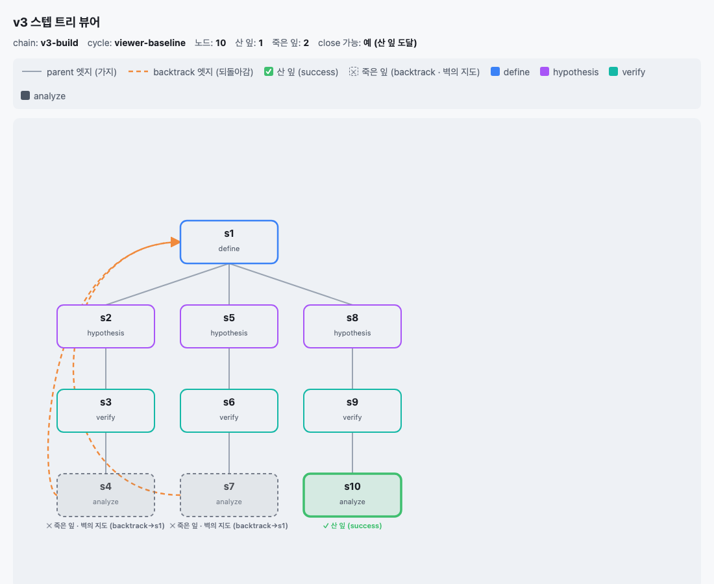
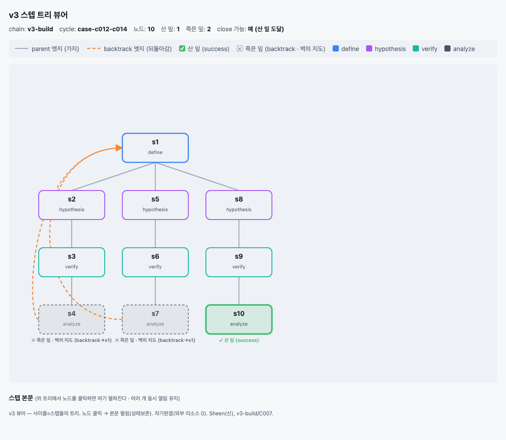
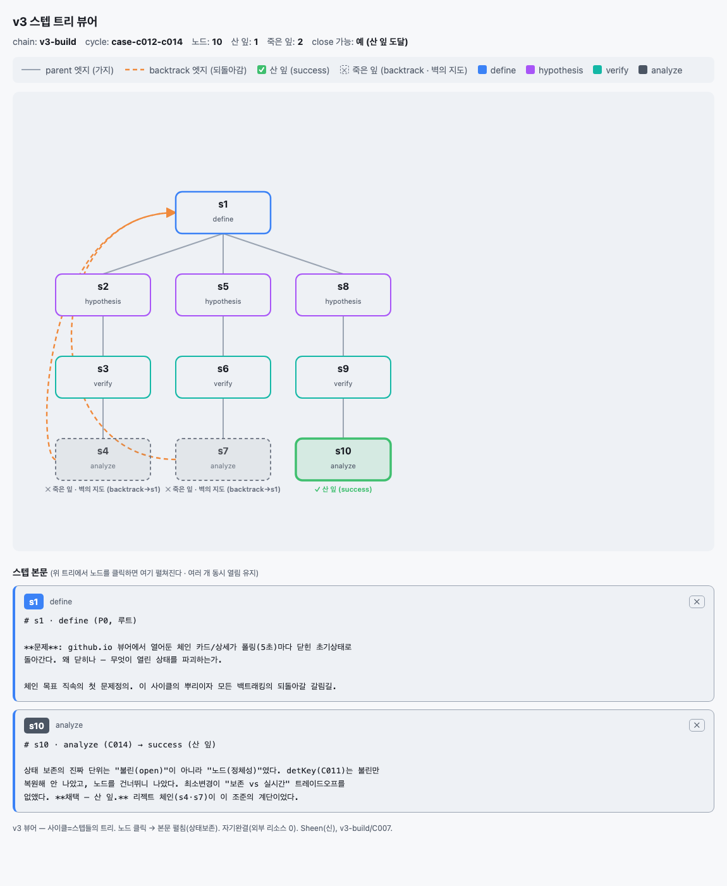
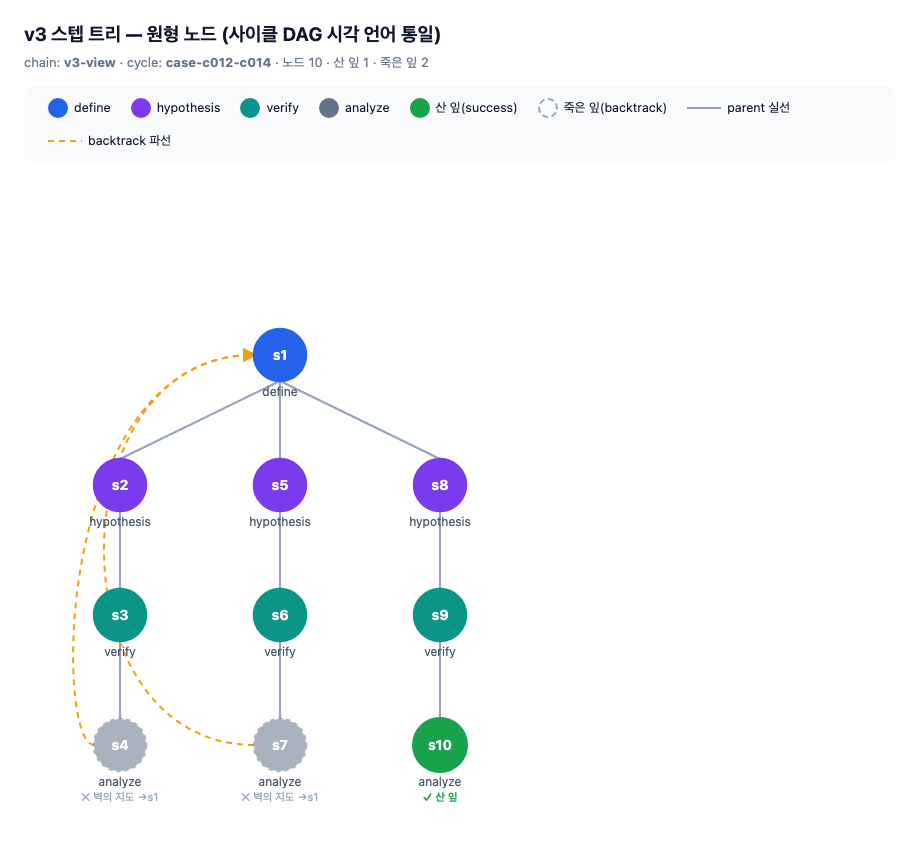
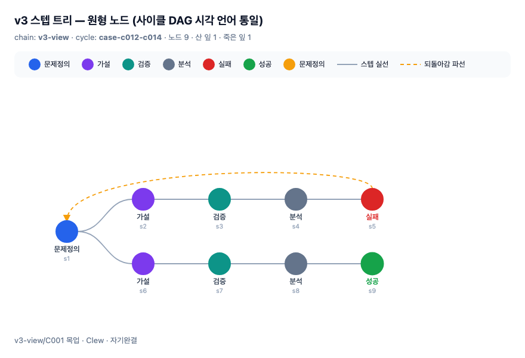
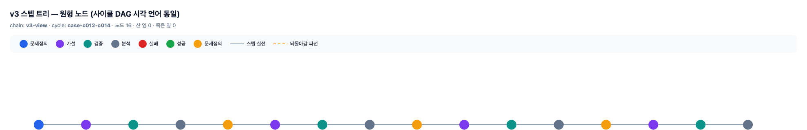

# v3 뷰어 디자인 리뷰 (라이브 문서)

상현님과 **캡쳐 → 피드백 → 사이클**로 v3 스텝 트리 뷰어를 다듬는 작업 공간.
각 라운드마다 현재 뷰어를 실제로 렌더해 캡쳐를 여기 박고, 피드백을 가설로 사이클을 돈다.
뷰어 구현·검증은 Sheen의 영역 — 이 문서는 "무엇을/왜"의 합의를 남긴다.

---

## R0 — 기준선 (현재 뷰어, 2026-07-21)

지금까지 지은 뷰어의 상태. 앞으로의 피드백은 이 기준선 위에서 잰다.

### R0-a · C004/C005 정적 트리 (본문 없음)

C004(Sheen)가 지은 최초 뷰어 — 한 사이클 안의 스텝 트리를 인라인 SVG로.

- 세로=depth, 가로=형제. `s1 define`(루트) 아래 세 형제 가지(s2·s5·s8).
- **parent 엣지**=회색 실선, **backtrack 엣지**=주황 파선 곡선+화살촉(잎→조상 s1).
- 죽은 잎(s4·s7)=회색·흐림·"벽의 지도" 캡션, 산 잎(s10)=초록·"산 잎(success)".
- 상단 헤더(노드 수·산 잎·죽은 잎·close 가능) + 범례.

### R0-b · C007 상호작용 뷰어 — 접힘 (기본 상태)

C007(Sheen)이 더한 것 — 노드를 클릭하면 아래 "스텝 본문" 영역에 그 노드의
`steps/<id>.md`가 펼쳐진다. 기본은 전부 접힘.

### R0-c · C007 상호작용 뷰어 — 펼침 (s1·s10 동시 열림)

노드를 클릭하면 본문 카드가 아래에 열리고, **여러 개가 동시에 열린 채 유지**된다
(상태 보존 — Sheen의 C010/C014 계보: "열린 것은 안 잃는다").

- 각 본문 카드: `s1 define` 배지 + 본문 마크다운 원문(아직 raw text) + 닫기(✕).
- s1(루트 문제정의)과 s10(산 잎 채택)을 동시에 열어둔 모습.

---

## 피드백 로그

여기에 상현님 피드백과 그로 파생된 가설·사이클을 시간순으로 남긴다.

### R0 피드백 (상현님, 2026-07-21) — 방향 확정

**"뷰어를 지금이랑 거의 동일하게 가자"** + 3층 드릴다운으로:

1. **체인**을 누르면 카드가 펼쳐지며 **사이클 DAG**를 본다 (지금 v2 뷰어의 그 그래프).
2. 그 사이클 DAG에서 **사이클 노드**를 누르면 아래에 카드가 열리며 **스텝 트리**를 본다.
3. **스텝 트리는 사이클 DAG처럼 동그라미(원형 노드) + 실선 그래프**로. kind를 **색으로 구분**.

**결정 (Clew 확인)**: backtrack(되돌아감) 엣지는 **파선으로 구별 유지** — parent 가지는
실선, backtrack은 파선. 실선으로 통일하면 "되돌아가 난 형제"와 "자란 자식"이 시각적으로
안 갈리므로, v3의 핵심(백트래킹 명시화)을 살리려면 구별이 남아야 한다.

**핵심 변화**: 지금 스텝 트리(C004/C007)는 **박스형 노드**다. 이걸 사이클 DAG와 같은
**원형 노드 + 실선** 시각 언어로 바꿔 세 층(체인·사이클·스텝)을 한 언어로 잇는다.
본문 펼침(C007)·상태 보존은 유지.

→ R1: 원형 노드 스텝 트리 목업을 렌더해 방향 확인 후 Sheen 사이클로.

---

## R1 — 원형 노드 스텝 트리 목업, **가로 흐름** (v3-view/C001, 2026-07-21)

R0 피드백 + 상현님 R1 추가 피드백(**"가로로 그려지는 사이클 DAG 그림이 딱 좋다"**)대로
스텝 트리를 **사이클 DAG와 같은 가로 흐름 + 원형 노드 + 실선 + 색 구분**으로.
depth=가로축(왼→오른), 형제 가지=세로축. backtrack은 파선 유지.

- **가로 흐름**: `s1 define`(왼쪽 시작점) → 세 가지가 오른쪽으로. 각 가지는
  hypothesis→verify→analyze로 왼→오른 (사이클 DAG의 C001→C002→… 흐름과 같은 방향).
- **원형 노드**: id를 원 안에, kind를 원 아래. kind 색 — define 파랑·hypothesis 보라·
  verify 청록·analyze 회색.
- **parent 엣지 = 실선**(부모 우측→자식 좌측, S자 곡선으로 lane 분기),
  **backtrack 엣지 = 파선 아치**(잎 위로 아치를 그려 조상 s1로 되돌아감 — 겹침 회피).
- **죽은 잎**(s4·s7) = 파선 원+흐림+"벽의 지도 →s1", **산 잎**(s10) = 초록 채움+"산 잎".
- 위상 검증(M1): 원 10·parent 9·backtrack 2·죽은 잎 2·산 잎 1 — 정보 손실 0, 자기완결.

---

## R2 — 결과 잎 노드화 + 원 아래 이름 + 작은 원 (2026-07-21)

R1 피드백(상현님):
1. **analyze 다음에 결과 잎을 별도 노드로** — analyze가 죽은/산 잎이 되는 게 아니라,
   analyze **다음 노드**가 실패/성공/문제정의. chain.md 스텝 문법(`분석→[실패|문제정의*|성공]`)
   과 정확히 일치. → 이는 **데이터 모델 변경**이라 이 사이클(뷰어)이 아니라 v3-build에서
   별도 사이클로. 여기선 **미래 형태 샘플 데이터**(`mock-data/steps.yaml`)로 목업만.
2. **원 아래에 이름** (사이클 DAG처럼): 원 안은 비우고 이름을 아래에, id는 더 아래 작게.
3. **원을 더 작게** (R 26→18).

- **결과 잎이 별도 노드**: 위 가지 `문제정의→가설→검증→분석→실패`(빨강, s5, 파선으로
  문제정의 s1 되돌아감), 아래 가지 `→분석→성공`(초록, s9). 7색 kind 구분(문제정의 파랑·
  가설 보라·검증 청록·분석 회색·실패 빨강·성공 초록·문제정의(재)주황).
- **원 아래 이름 + 작은 원**: 사이클 DAG 언어. 원 안 비움, 이름 아래, id 더 아래 작게.

### R2 판정 대기 (상현님 눈이 판정자, K3)

이 방향이 맞으면 이 뷰어 사이클 supported → Sheen이 3층 드릴다운·본문 펼침으로 확장,
그리고 **결과 잎 노드화(모델 변경)는 v3-build에서 C002 재개 사이클로** 별도 진행.
아니면 rejected → 피드백을 다음 라운드 가설로.

---

## 이 티키타카 자체를 스텝 트리로 담다 (gilv3 첫 도그푸딩, 2026-07-21)

상현님: *"너랑 나랑 티키타카하는 이 모든 게 스텝으로 담겨야 하는 건데. 기록이 하나도
안 남는 게 좀 그렇네."* — 정확한 지적. 이게 v3가 푸는 문제다. 그래서 **방금 지은 gilv3로
이 R0→R1→R2 대화를 실제 스텝 트리로 각인**했다 (`design-steptree/steps.yaml`).

**상현님 문법 불변식 (완성형, 2026-07-21)**:
1. *분석 다음엔 반드시 실패/문제정의/성공 중 하나가 나와야 한다 (없으면 안 닫힌 것).*
2. **세 결과의 의미가 다르다**:
   - **실패(fail)** = 백트래킹과 연결 — 파선으로 조상 문제정의 복귀. 죽은 잎.
   - **문제정의(redefine)** = 잎이 **아니다**. **앞으로 새 가지를 뻗는 노드** (자식을 낳는
     분기점). 파선 없음.
   - **성공(success)** = 산 잎, 끝.

→ 우리 티키타카는 **되돌아간 적 없이, 매 분석마다 문제를 새로 정의하며 앞으로 나아가
성공에 닿은 하나의 체인**이었다 (내가 "되돌아감"으로 오해한 게 사실은 "문제정의로 앞으로"):

`문제정의(s1)→…→문제정의(s5)→…→문제정의(s9)→…→문제정의(s13)→가설→검증→분석(s16, 진행중)`

- **s5 문제정의**: 세로→"가로로 가자" (앞으로).
- **s9 문제정의**: 가로 확인→"결과잎·작은원·이름으로 가자" (앞으로).
- **s13 문제정의**: 시각 방향 확정→"원 더 작게, 귀엽게" (앞으로 — 성공이 아니었다!).
- **s16 분석**: DAG 비율(r=9)에 맞춰 원 축소 캡쳐 → **결과 잎 아직 없음 = 진행 중**.

**중요 — 성공은 상현님이 "됐다"고 할 때만 선다**: s13을 처음 성공으로 그렸으나, 상현님이
"더 작게"로 정련을 이어가셨다 = 그건 성공이 아니라 **문제정의로 앞으로**였다. 지금 트리는
산 잎 0·죽은 잎 0 = 진행 중(s16 분석 후 결과 잎 대기). 문법이 살아 움직인다:
- 상현님 "이 작은 원 됐다" → s16 다음 **성공** 잎 → 닫힘.
- "더 정련" → **문제정의**로 앞으로.
- "이 방향 틀렸다" → **실패**로 파선 백트래킹.

실패가 없으니(버린 시도 없음) 파선·죽은 잎 0. **뷰어가 자기를 설계한 대화를 그린다** —
자기증명 + gilv3 첫 도그푸딩. 피드백마다 이 트리에 각인 중.

*(이 문법(문제정의=앞으로 분기, 실패=백트래킹, 성공=끝)을 **모델에 실제 반영**하는 건
뷰어 완성 후 v3-build C002 재개로 — 상현님: "트리만 완성하고, 뷰어 다 만들면 모델에까지
적용." 지금은 뷰어가 그릴 정확한 데이터로 담았다.)*

---

## 열린 질문 (논의 촉발용)

- **엉킨 backtrack 엣지**: 되돌아감이 여럿이면 s2 가지를 가로지르며 겹친다. 라우팅?
- **본문이 raw text**: `steps/<id>.md`가 마크다운 렌더 없이 그대로. 렌더할지.
- **색·여백·타이포**: 지금은 기능 위주. 시각 언어를 다듬을지.
- **트리 스코프**: 지금은 한 사이클. 체인 전체(사이클 DAG)로 줌아웃할지.
